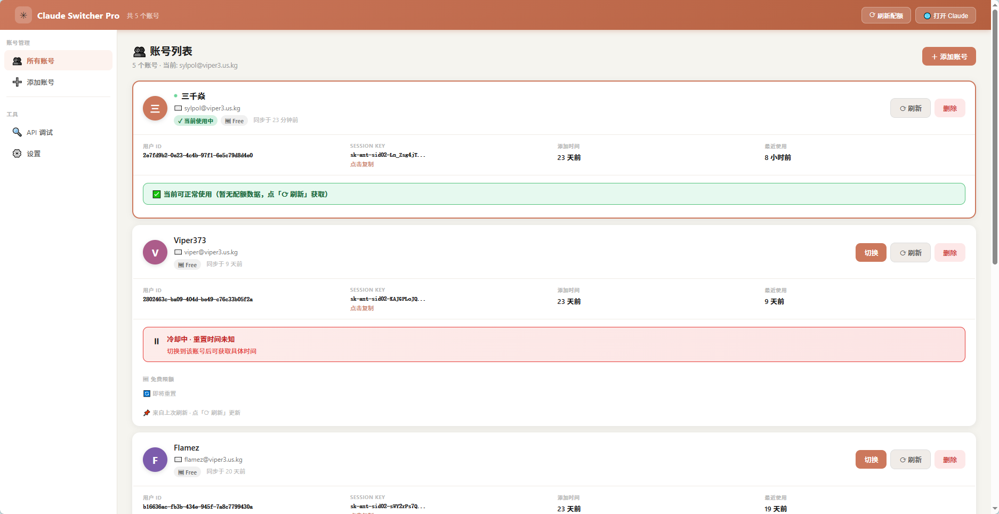
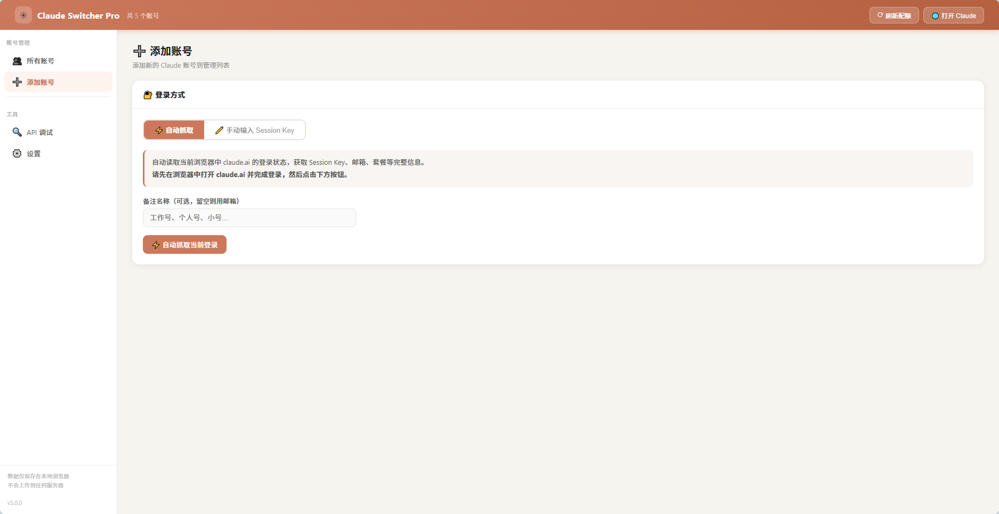
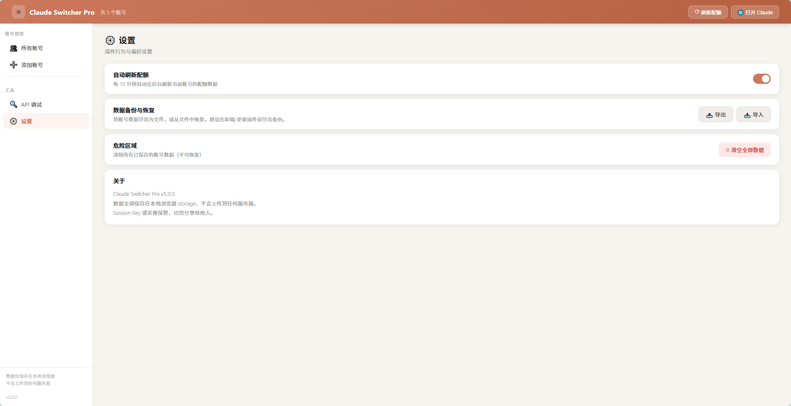
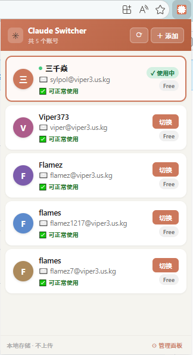
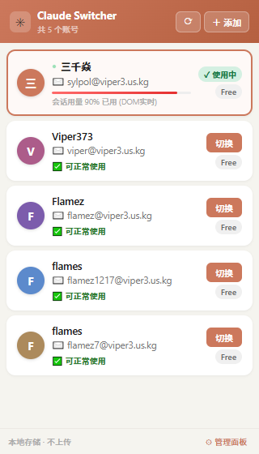

# Claude Switcher

一个用于在 Chrome/Edge 中快速切换和管理多个 `claude.ai` 账号的 Manifest V3 浏览器扩展。

## 截图预览




<p align="center">
  
  
</p>

## 功能特性

- 多账号本地存储（`chrome.storage.local`）
- 通过恢复 `sessionKey` 与相关 Cookie 一键切号
- 弹窗快速切换界面
- 管理面板（添加/删除/导入/导出/调试）
- 基于 API 与页面信号的用量/限流状态检测

## 项目结构

- `manifest.json`：MV3 扩展配置
- `background.js`：核心逻辑（账号存储、Cookie 切换、消息路由）
- `content.js`：页面内 fetch 代理与限流提示检测
- `popup.html` / `popup.js`：轻量切换弹窗
- `dashboard.html` / `dashboard.js`：完整管理面板
- `icons/`：扩展图标

## 安装方式（开发者模式）

1. 打开 `chrome://extensions`（或 `edge://extensions`）。
2. 启用“开发者模式”。
3. 点击“加载已解压的扩展程序”。
4. 选择本项目目录。

## 安全说明

- 账号导出的 JSON 含有敏感会话数据。
- 请对备份文件进行私密保存与加密保护。
- 不要将真实账号备份文件提交到 git。
- 仓库默认忽略 `claude_accounts*.json`，仅保留 `claude_accounts.sample.json` 作为可共享示例。

## 本地开发

本项目无需构建步骤，直接修改源码并重载扩展即可。

快速语法检查：

```powershell
node --check background.js
node --check content.js
node --check popup.js
node --check dashboard.js
```

## 许可证

MIT

## 免责声明

本项目为独立工具，与 Anthropic 无官方关联，也未获得其背书。
